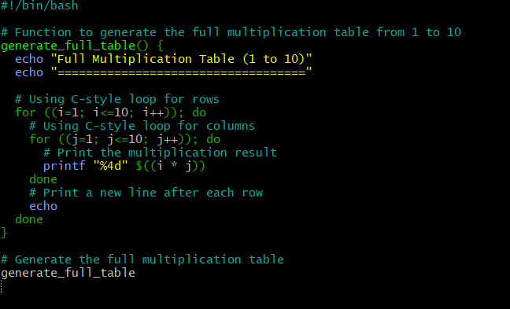

# Capstone Project: Linux Shell Scripting

## Multiplication Table Generator

This project contains a Bash script that generates a multiplication table for a user-specified number. The script allows the user to choose between viewing a full table (1 to 10) or a partial table within a custom range.


## Getting Started

1. **Clone the Repository**:

    ```bash
    git clone https://github.com/Aded0yin/Capstone_Project-Linux_shell_scripting.git
    cd Capstone_Project-Linux_shell_scripting
    ```
   

2. **Create the script**


   


3. **Make the Script Executable**:
    ```bash
    chmod +x multiplication-table
    ```
   


4. **Run the Script**:
    ```bash
    ./multiplication-table
    ```


- The script will prompt you to enter a number for which you want to generate the multiplication table.
- Enter the number and press Enter.
- The script will then ask if you want to see a full multiplication table from 1 to 10 or a partial table within a specific range.
- Enter your choice:
   - For a full table, type `1` and press Enter.
   - For a partial table, type `2` and press Enter, then provide the range (start and end values).

## Full table


## Partial Table


## C-Style Table

**Create script**




**Make the Script Executable**

```
chmod +x c-style_multiplication-table
```

**Run the Script**

```
 ./c-style_multiplication-table 
```


## Invalid Range


- Add Shell scripts to the Git repository


- Commit changes with descriptive message


- Push the code to Github repository


